

# AuthNest

**Login, registration and user management for your website, without building it yourself.**

[Website](https://authnest.org) · [Documentation](https://authnest.org/docs/introduction) · [Pricing](https://authnest.org/pricing) · [Status](https://authnest.org/status) · [Changelog](https://authnest.org/changelog) · [Roadmap](https://authnest.org/public-roadmap)

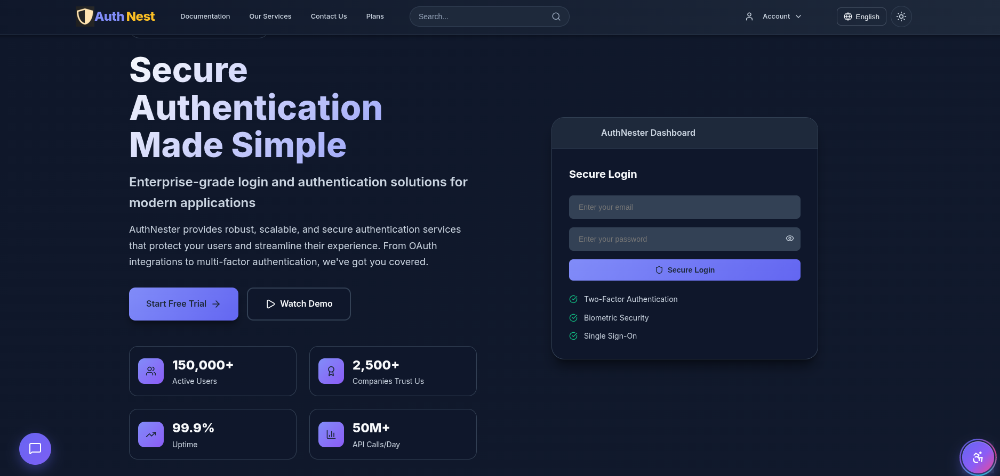

> **About this repository.** AuthNest is a hosted service, and its source code is private. This repository is the
> public home of its **documentation, security and privacy explanations, roadmap and feedback channel**, so you can
> judge the product before you sign up. It contains no source code.

---

## What is AuthNest?

Almost every website or app needs the same things: sign-up, login, email verification, password reset, two-step
verification and a place to see who your users are. Building and securing all of that properly takes weeks, and
mistakes are expensive.

**AuthNest is that whole system as a service.** You create an account, connect your website, and your users get
secure, ready-made pages for signing up and logging in. Your own server then reads verified user information through
a small SDK.

It is built by [Elvoroz](https://authnest.org/about-us) and it is **free to start**.

## Who is it for?

- **Developers and small teams** who want login working today, not next month.
- **Freelancers and agencies** who add accounts to many client websites and don't want to rebuild it each time.
- **Startups** who want security features such as passkeys and two-step verification without hiring for it.

## Three kinds of people, one platform

| Role | Who they are | What they do in AuthNest |
|---|---|---|
| **Client** | You: the business or developer with a website | Connect your website, get API keys, choose login methods, design the sign-up form, watch analytics and logs |
| **User** | Your customers | Sign up and log in through AuthNest pages, manage their profile, security and devices |
| **Admin** | The AuthNest team | Run and protect the platform |

## How it works

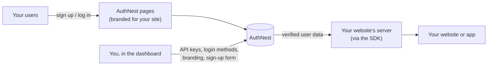

1. **Create your account** and connect your website.
2. **Install an SDK** (Node, React, or plain JavaScript / React Native).
3. **Send users to sign up or log in.** AuthNest handles the pages, verification, sessions and security.
4. **Read the verified user** on your server and carry on with your own logic.

More detail: [How it works](docs/HOW_IT_WORKS.md) · [Get started in 10 minutes](docs/GETTING_STARTED.md)

## See it

| | |
|---|---|
| 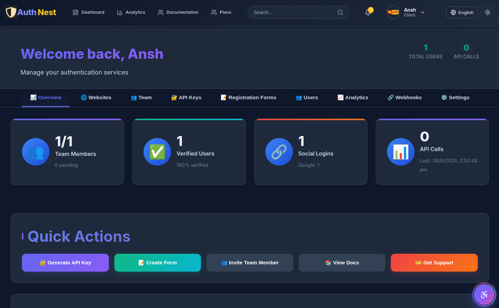 **Your dashboard.** Users, activity and health at a glance. | 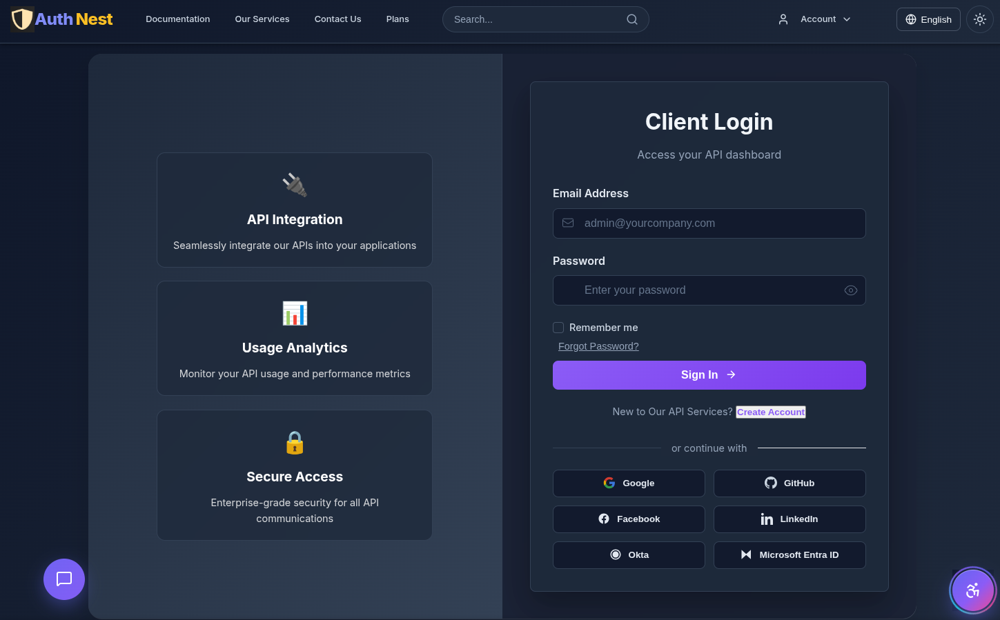 **Choose how people sign in.** Social, passwordless, passkeys. |
| 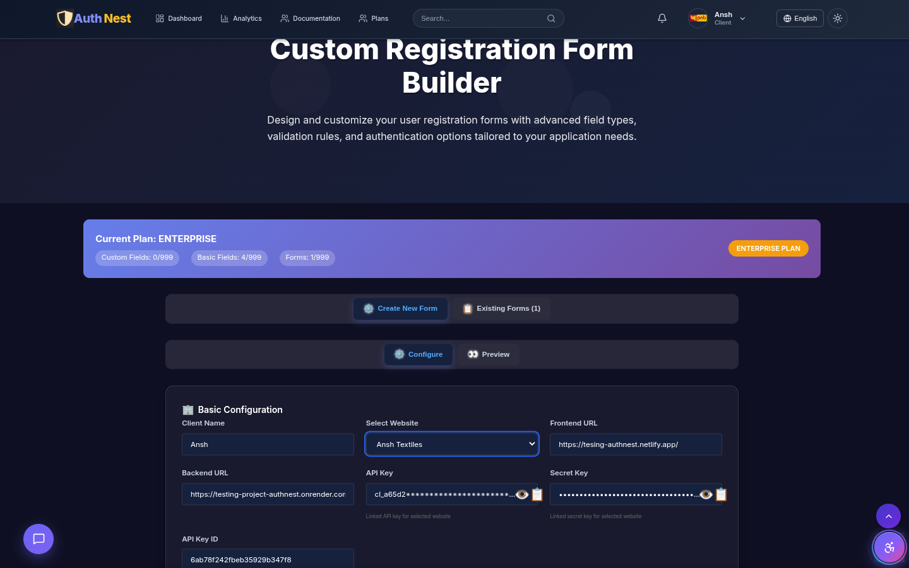 **Design your own sign-up form.** Add the fields you need. | 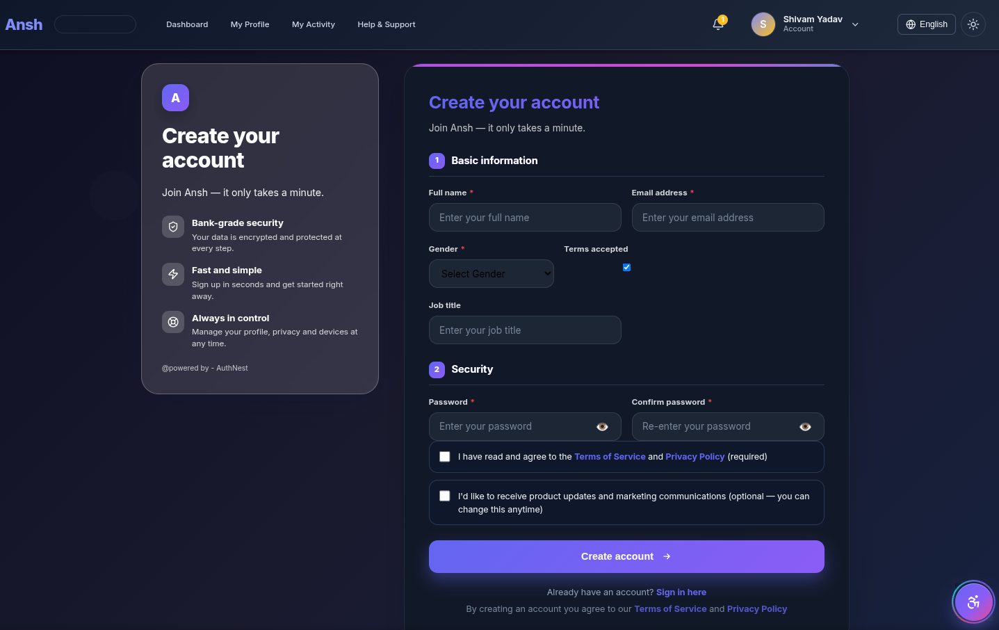 **What your users see.** A clean, ready-made signup page. |
| 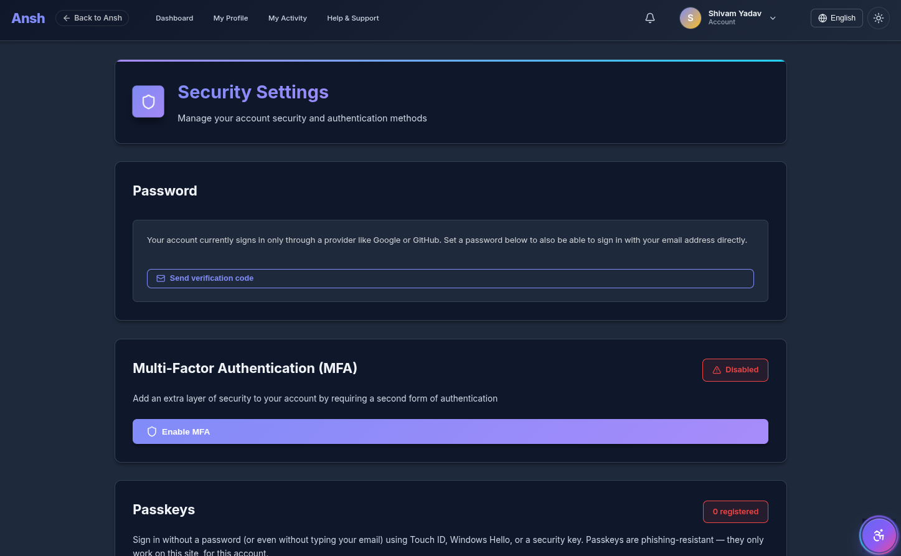 **Real security controls for users.** Two-step verification and passkeys. | 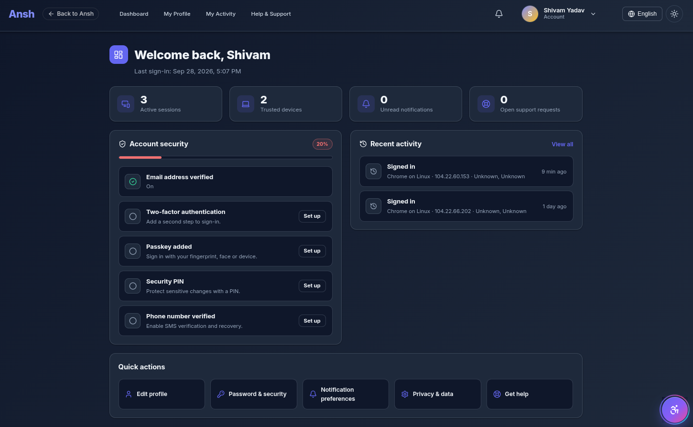 **Know what's happening.** Sign-ups and activity over time. |
| 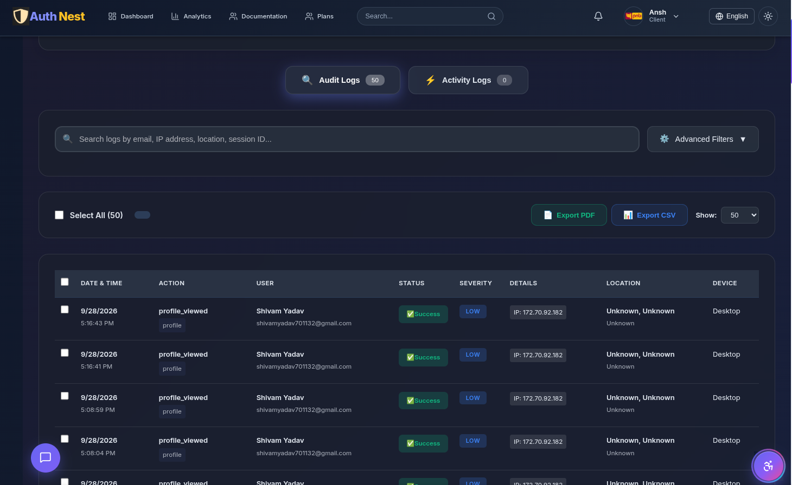 **A record of activity.** Logs for you and for your users. | 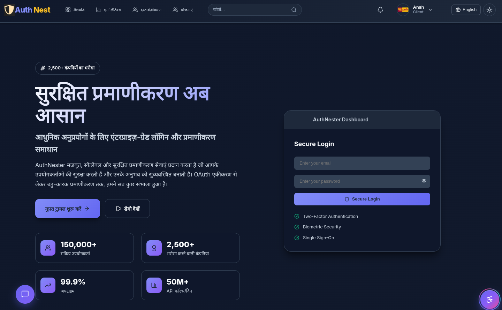 **Six languages,** including right-to-left Arabic. |
| 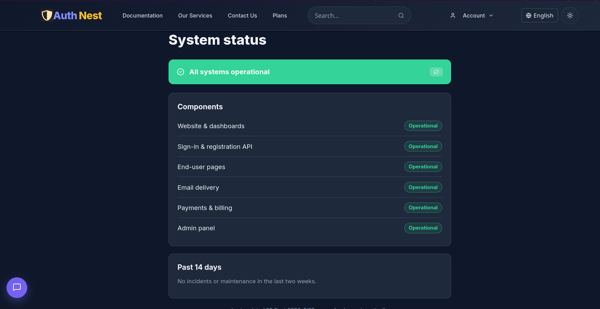 **Nothing hidden.** A public status page. | 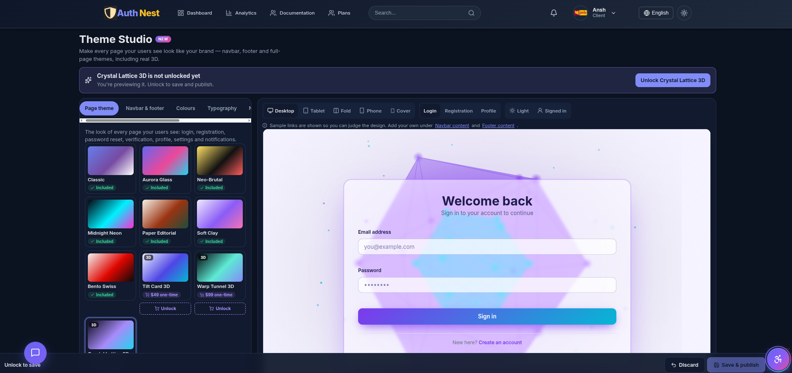 **Match your brand** with Theme Studio (top plan). |

Working inside a real website: 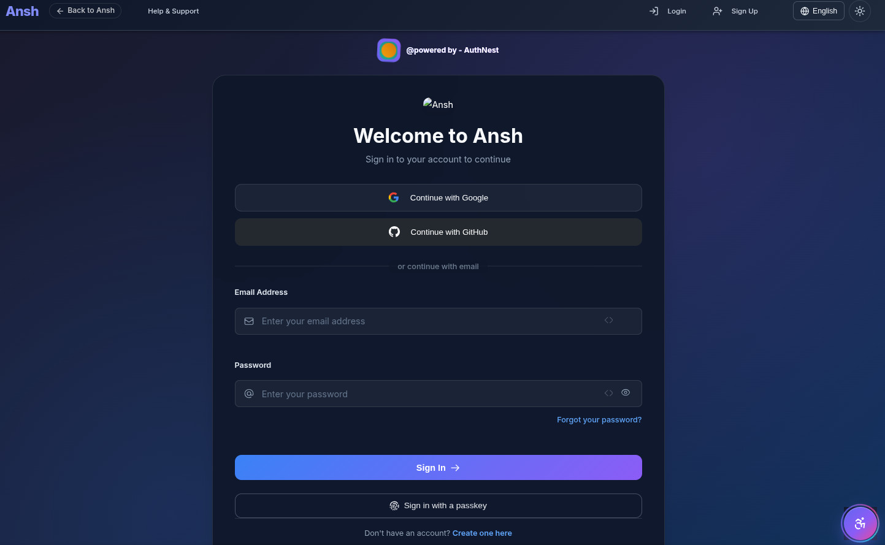

## What you get

| Area | Highlights |
|---|---|
| **Sign-in** | Email and password, Google and GitHub sign-in, email/SMS one-time codes and magic links, passkeys. Some methods depend on your plan. |
| **Security** | Two-step verification (authenticator app, passkeys, backup codes), short-lived sessions with rotating refresh tokens, rate limiting, security headers, activity and audit logs. |
| **Sign-up** | Email verification, multiple password-recovery options, a sign-up form you design yourself. |
| **Your users' account area** | Profile, security settings, signed-in devices, activity log and notifications on ready-made pages. |
| **Your dashboard** | Analytics, user list, logs, team members, login-method settings, bulk user import. |
| **Developer experience** | Three SDKs, an API description, guides and a test website. |
| **Reach** | English, Hindi, Spanish, French, Mandarin Chinese and Arabic (right-to-left) in the core flows; an accessibility toolbar. |
| **Transparency** | A public status page, changelog and roadmap. |

The full list is in [Features](docs/FEATURES.md). Which plan includes what is always shown on the
[pricing page](https://authnest.org/pricing), which is the source of truth.

## SDKs

| Package | Use it for | Install |
|---|---|---|
| [`@elvoroz/authnest-server`](https://www.npmjs.com/package/@elvoroz/authnest-server) | Node.js and Express backends | `npm install @elvoroz/authnest-server` |
| [`@elvoroz/authnest-react`](https://www.npmjs.com/package/@elvoroz/authnest-react) | React web apps | `npm install @elvoroz/authnest-react` |
| [`@elvoroz/authnest-client`](https://www.npmjs.com/package/@elvoroz/authnest-client) | Any JavaScript app, React Native and Expo | `npm install @elvoroz/authnest-client` |

Details and guidance on which one to pick: [SDKs](docs/SDKS.md).

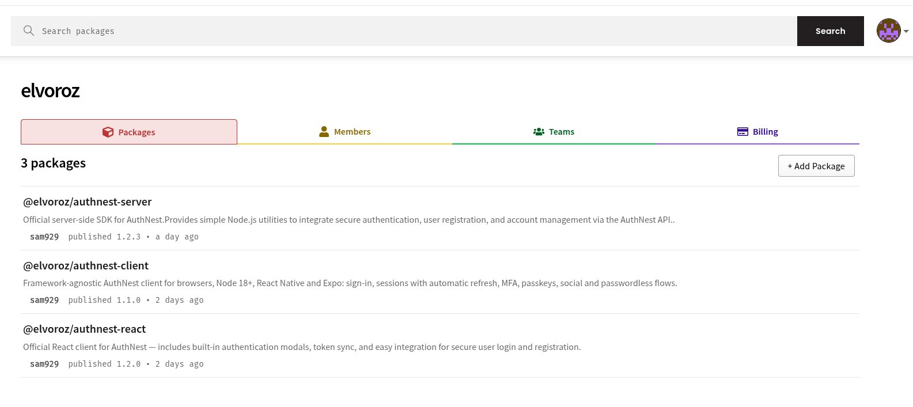

## Security and privacy, in plain language

We would rather show our work than ask you to take our word for it.

- [Security and trust](docs/SECURITY_AND_TRUST.md): how passwords, sessions, two-step verification and the platform itself are protected, and what we do **not** claim.
- [Privacy and your data](docs/PRIVACY_AND_DATA.md): who owns what, what we store and why.
- [Reporting a vulnerability](SECURITY.md)

## An honest look at where we are

- AuthNest is **new** and built by a small team. It is live and working, and it is young.
- We are **not** SOC 2, ISO 27001 or HIPAA certified, and we say so rather than imply otherwise. See
  [Security and trust](docs/SECURITY_AND_TRUST.md).
- Paid plans are being switched on now; the Free plan is available today. See the [roadmap](docs/ROADMAP.md).
- If you are considering AuthNest for something important, talk to us first. We will help you integrate, and we
  will tell you honestly if it is not the right fit yet.

## Legal

| | |
|---|---|
| [License](LICENSE) | These documents are © Elvoroz, all rights reserved. This repository contains no source code. |
| SDK licence | Each SDK package ships with its own license agreement. They are proprietary, not open source. |
| [Trademarks](TRADEMARKS.md) | How the AuthNest and Elvoroz names and logos may be used. |
| [Contributing](CONTRIBUTING.md) | What happens to feedback you post here. |
| [Terms](https://authnest.org/terms) · [Privacy](https://authnest.org/privacy-policy) · [Cookies](https://authnest.org/cookies) | The binding legal documents for using AuthNest. |

## Talk to us

- Questions, ideas and bug reports: [open an issue](../../issues/new/choose)
- General contact: [authnest.org/contact-us](https://authnest.org/contact-us)
- Security reports: see [SECURITY.md](SECURITY.md)
- Want a guided walkthrough? [Schedule a demo](https://authnest.org/schedule-demo)

---

Built by **[Elvoroz](https://authnest.org/about-us)** · © 2026 Elvoroz. All rights reserved. [License](LICENSE) · [Trademarks](TRADEMARKS.md) · [Terms of Service](https://authnest.org/terms) · [Privacy Policy](https://authnest.org/privacy-policy) · [Contributing](CONTRIBUTING.md)

