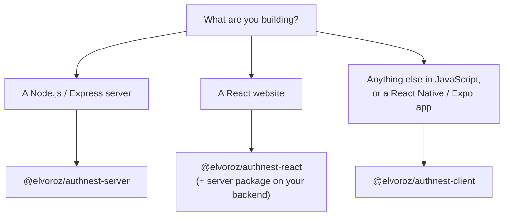

# SDKs

AuthNest has three official packages on npm. They are proprietary and free to install; using them needs an AuthNest
account. Their npm pages always show the latest version.

## Which one do I need?



Most web projects use the **server** package on the backend and the **React** package on the front end.

## `@elvoroz/authnest-server`

For Node.js and Express backends.

- Ready-made route handlers for registration, login, user data and email verification.
- Security middleware and the CORS setup for AuthNest sessions.
- Helpers that build the sign-up and login links and read a verified user from a session.
- The handoff that lets a signed-in user open their AuthNest account pages without logging in again.

```
npm install @elvoroz/authnest-server
```
[npm page](https://www.npmjs.com/package/@elvoroz/authnest-server)

## `@elvoroz/authnest-react`

For React websites.

- A hook that tells you whether the visitor is signed in, with login and logout actions.
- Ready-made buttons and navigation to AuthNest's sign-up, login and account pages.
- Built-in dialogs for two-step verification, password and email steps.
- Keeps the login token in sync with AuthNest, so your pages always know the current state.

```
npm install @elvoroz/authnest-react
```
[npm page](https://www.npmjs.com/package/@elvoroz/authnest-react)

## `@elvoroz/authnest-client`

For any JavaScript app, including **React Native and Expo**. It has no dependencies and ships with TypeScript types.

- Login with password, one-time codes, magic links, passkeys and social sign-in.
- Two-step verification flows.
- Sessions that refresh themselves. Several requests failing at once share a single refresh, so a rotating refresh
  token is never used twice.
- Storage options for browsers and for secure phone storage (Keychain and Keystore).
- Opens the user's AuthNest account pages, already signed in.

```
npm install @elvoroz/authnest-client
```
[npm page](https://www.npmjs.com/package/@elvoroz/authnest-client)

## Versioning and changes

We publish changes in the [changelog](https://authnest.org/changelog) and each package has its own changelog on npm.
If something you rely on is going to change, we will say so there first.

## Licence

The packages are proprietary, not open source. See [LICENSE](../LICENSE).
